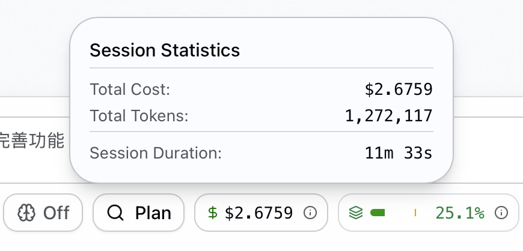
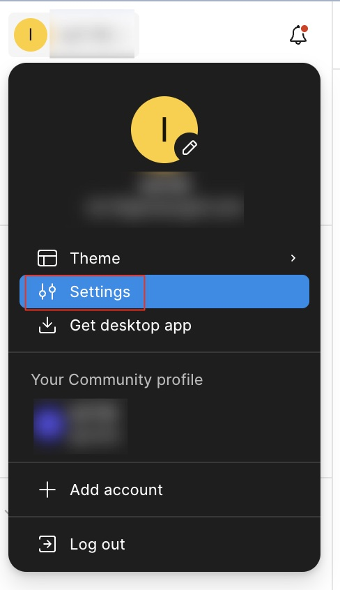
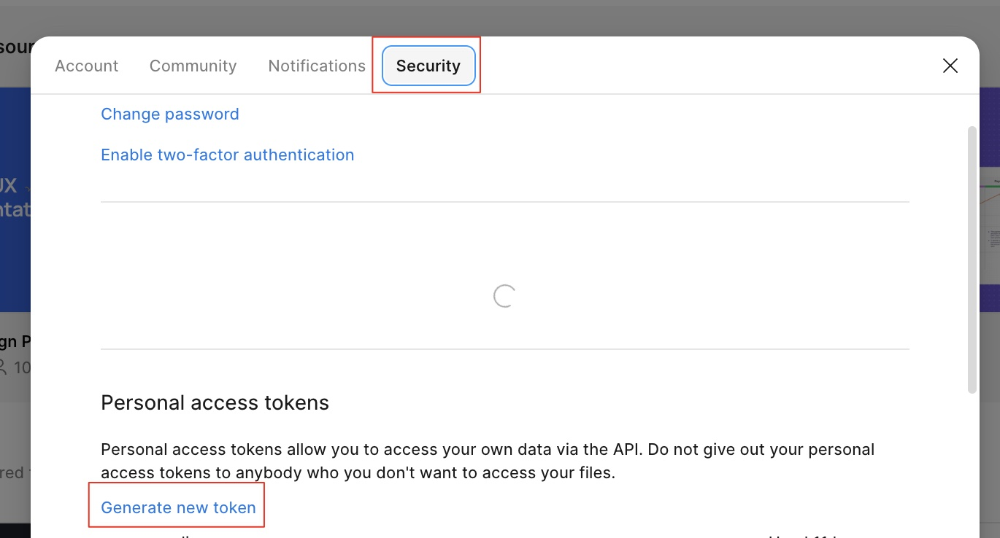

# figma-dump

The most token-efficient and accurate Figma export skill for coding agents.

Export Figma designs as a compact, indented **UI structure tree** with CSS-mappable properties — optimized for LLM context windows. One API call, zero fluff.

[中文文档](./README.zh-CN.md)

## Why

We fetched the same complex Figma design with the official Figma MCP, [figma-context-mcp](https://github.com/glips/figma-context-mcp) (14.5k stars as of 2025-04-22), and figma-dump. Here's what happened:

| | Official Figma MCP | figma-context-mcp | figma-dump |
|---|---|---|---|
| Total Cost | **$7.4587** | **$2.6759** | **$1.6952** |
| Total Tokens | 4,159,799 | 1,272,117 | 749,008 |
| Context Window | 100% — overflowed | 25.1% | 23.8% |
| Tool Calls | Multiple MCP tools | MCP tool calls | 1 script call |
| Output Format | Raw JSON | Simplified JSON | CSS-ready tree |
| Code Accuracy | Low — context overflow | Good | Good |

> **77% cheaper than official MCP. 37% cheaper than figma-context-mcp. Same accuracy, fewer tokens.**
>
> The official MCP blew the context window entirely. figma-context-mcp produces comparable code quality, but figma-dump uses **41% fewer tokens** to achieve the same result — CSS-ready properties leave less room for LLM hallucination.

| Official Figma MCP | figma-context-mcp | figma-dump |
|---|---|---|
|  |  |  |

```
[FRAME] "card" w:361 h:HUG bg:#fff radius:12 shadow:0,2,8,0,#0000001a flex:col p:16 gap:12 clip
  [TEXT] "Title" "Hello" font:Inter/14/500 color:#666 align:center lh:20
  [FRAME] "row" w:FILL h:HUG flex:row justify:between items:center
    [INSTANCE] "btn" (ButtonPrimary) w:HUG h:36 bg:#0066ff radius:8
```

Every property maps 1:1 to CSS. No intermediate JSON. No wasted tokens.

Want to compare yourself? Set up the official MCP and try the same design:

```bash
# Claude Code
claude mcp add --transport http figma-remote-mcp https://mcp.figma.com/mcp

# Codex
codex mcp add figma-remote-mcp --url https://mcp.figma.com/mcp
```

## Features

- **Compact tree output** — one node per line, indentation = hierarchy
- **CSS-ready properties** — `flex:row`, `p:16`, `radius:12`, `bg:#fff` — copy straight to code
- **Component awareness** — INSTANCE nodes show their component name: `(ButtonPrimary)`
- **Rendered image** — fetches a 2× PNG screenshot alongside the tree
- **Zero dependencies** — single Node.js script, no install step

## Install

### Claude Code

```bash
# Project-level (current repo only)
git clone https://github.com/anthropics/figma-dump.git .claude/skills/figma

# Global (available in all projects)
git clone https://github.com/anthropics/figma-dump.git ~/.claude/skills/figma
```

### Codex

```bash
# Project-level (current repo only)
git clone https://github.com/anthropics/figma-dump.git .codex/skills/figma

# Global (available in all projects)
git clone https://github.com/anthropics/figma-dump.git ~/.codex/skills/figma
```

### Disable the official Figma MCP (if installed)

To avoid interference, disable the official Figma MCP before using figma-dump.

In your Claude Code or Codex MCP settings, set the official Figma MCP to `disabled`.

Or remove it entirely:

```bash
# Claude Code
claude mcp remove figma-remote-mcp

# Codex
codex mcp remove figma-remote-mcp
```

### Get a Figma Personal Access Token

You need a Figma access token to use the API. Here's how to create one:

1. Open Figma, click your avatar (top-left), then go to **Settings**

   

2. Switch to the **Security** tab, scroll to **Personal access tokens**, and hit **Generate new token**

   

3. Give it a name, and make sure **File content** and **Dev resources** have at least read access. Click **Generate token** and copy it.

> For full details, see [Figma's official docs on access tokens](https://help.figma.com/hc/en-us/articles/8085703771159-Manage-personal-access-tokens).

Then set it in your environment:

```bash
export FIGMA_TOKEN="your-figma-personal-access-token"
```

## Usage

### As a Claude Code skill

```
/figma https://www.figma.com/design/abc-def/MyApp?node-id=123-4566
```

### As a standalone script

```bash
# From URL
node .claude/skills/figma/scripts/figma_fetch.mjs \
  --url='https://www.figma.com/design/FILE_KEY/NAME?node-id=123-4566'

# From file key + node ID
node .claude/skills/figma/scripts/figma_fetch.mjs \
  --file-key=FILE_KEY --node-id=123-4566
```

## Output Format

Every line follows: `[TYPE] "name" (Component) "text content" ...properties`

| Property | Example | CSS equivalent |
|---|---|---|
| Size | `w:360` `h:HUG` `w:FILL` | `width: 360px` / `auto` / `100%` |
| Fill | `bg:#fff` `bg:linear(#fff,#000)` | `background` |
| Radius | `radius:12` `radius:12,12,0,0` | `border-radius` |
| Stroke | `border:1,#e0e0e0` | `border` |
| Shadow | `shadow:0,2,8,0,#0000001a` | `box-shadow` |
| Blur | `blur:8` `bg-blur:10` | `filter` / `backdrop-filter` |
| Layout | `flex:row` `justify:between` `gap:12` | `display:flex` + props |
| Padding | `p:16` `p:16,24` `p:16,24,16,24` | `padding` |
| Text | `font:Inter/14/500` `color:#333` `lh:20` | `font` / `color` / `line-height` |
| Misc | `opacity:0.5` `clip` `grow:1` | `opacity` / `overflow:hidden` / `flex-grow` |

## How it works

1. Parses the Figma URL to extract file key and node ID
2. Calls `GET /v1/files/:key/nodes` to fetch the node tree
3. Calls `GET /v1/images/:key` to get a rendered PNG
4. Walks the tree and serializes each node into the compact format

## License

MIT
