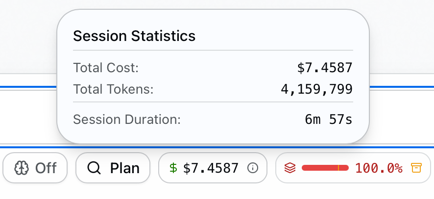
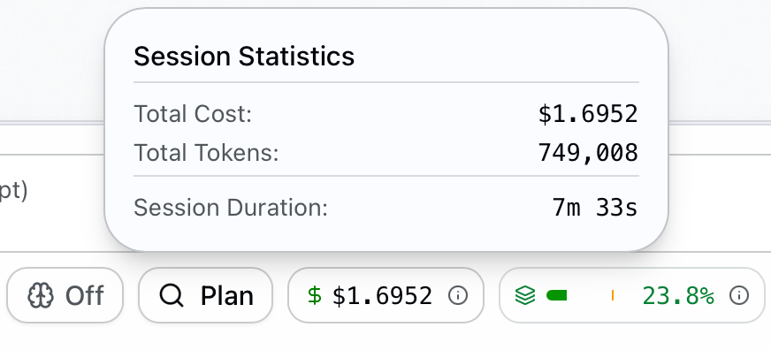

# figma-dump

为 coding agent 打造的、最省 token、最精准的 Figma 导出技能。

将 Figma 设计导出为紧凑的缩进式 **UI 结构树**，属性直接映射 CSS —— 专为 LLM 上下文窗口优化。一次 API 调用，零废话。

[English](./README.md)

## 为什么需要它

我们用同一个复杂 Figma 设计稿，分别跑了官方 Figma MCP 和 figma-dump，结果如下：

| | 官方 Figma MCP | figma-dump |
|---|---|---|
| 总费用 | **$7.4587** | **$1.6952** |
| 总 Tokens | 4,159,799 | 749,008 |
| 上下文窗口 | 100% —— 已爆满 | 23.8% |
| 工具调用 | 多个 MCP 工具协作 | 1 次脚本调用 |
| 输出格式 | 原始 JSON | CSS 就绪的树 |

> **省 77% 费用，省 5.6 倍 tokens。而且官方 MCP 直接把上下文撑爆了。**
>
> 实测中，基于 figma-dump 输出生成的代码**还原度也远高于官方 MCP** —— CSS 就绪的属性格式让 LLM 几乎没有幻觉空间。

| 官方 Figma MCP | figma-dump |
|---|---|
|  |  |

```
[FRAME] "card" w:361 h:HUG bg:#fff radius:12 shadow:0,2,8,0,#0000001a flex:col p:16 gap:12 clip
  [TEXT] "Title" "Hello" font:Inter/14/500 color:#666 align:center lh:20
  [FRAME] "row" w:FILL h:HUG flex:row justify:between items:center
    [INSTANCE] "btn" (ButtonPrimary) w:HUG h:36 bg:#0066ff radius:8
```

每个属性 1:1 映射 CSS。没有中间 JSON，零 token 浪费。

欢迎自行对比验证，先安装官方 MCP 再用同一个设计稿试试：

```bash
# Claude Code
claude mcp add --transport http figma-remote-mcp https://mcp.figma.com/mcp

# Codex
codex mcp add figma-remote-mcp --url https://mcp.figma.com/mcp
```

## 特性

- **紧凑树状输出** —— 每行一个节点，缩进即层级
- **CSS 就绪的属性** —— `flex:row`、`p:16`、`radius:12`、`bg:#fff` —— 直接复制到代码
- **组件感知** —— INSTANCE 节点显示组件名：`(ButtonPrimary)`
- **渲染截图** —— 同时获取 2× PNG 截图
- **零依赖** —— 单个 Node.js 脚本，无需安装

## 安装

### Claude Code

```bash
# 项目级别（仅当前仓库）
git clone https://github.com/anthropics/figma-dump.git .claude/skills/figma

# 全局（所有项目可用）
git clone https://github.com/anthropics/figma-dump.git ~/.claude/skills/figma
```

### Codex

```bash
# 项目级别（仅当前仓库）
git clone https://github.com/anthropics/figma-dump.git .codex/skills/figma

# 全局（所有项目可用）
git clone https://github.com/anthropics/figma-dump.git ~/.codex/skills/figma
```

### 关闭官方 Figma MCP（如已安装）

使用前请先关闭官方 Figma MCP，避免干扰。

在 Claude Code 或 Codex 的 MCP 设置中，将官方 Figma MCP 设为 `disabled` 即可。

或者删除：

```bash
# Claude Code
claude mcp remove figma-remote-mcp

# Codex
codex mcp remove figma-remote-mcp
```

### 设置 Figma token

```bash
export FIGMA_TOKEN="your-figma-personal-access-token"
```

## 使用方法

### 作为 Claude Code 技能

```
/figma https://www.figma.com/design/XPACZRSwWV297aqyeltAEc/MyApp?node-id=371-5024
```

### 作为独立脚本

```bash
# URL 模式
node .claude/skills/figma/scripts/figma_fetch.mjs \
  --url='https://www.figma.com/design/FILE_KEY/NAME?node-id=371-5024'

# file key + node ID 模式
node .claude/skills/figma/scripts/figma_fetch.mjs \
  --file-key=FILE_KEY --node-id=371-5024
```

## 输出格式

每行格式：`[TYPE] "name" (Component) "text content" ...properties`

| 属性 | 示例 | CSS 对应 |
|---|---|---|
| 尺寸 | `w:360` `h:HUG` `w:FILL` | `width: 360px` / `auto` / `100%` |
| 填充 | `bg:#fff` `bg:linear(#fff,#000)` | `background` |
| 圆角 | `radius:12` `radius:12,12,0,0` | `border-radius` |
| 描边 | `border:1,#e0e0e0` | `border` |
| 阴影 | `shadow:0,2,8,0,#0000001a` | `box-shadow` |
| 模糊 | `blur:8` `bg-blur:10` | `filter` / `backdrop-filter` |
| 布局 | `flex:row` `justify:between` `gap:12` | `display:flex` + 属性 |
| 内边距 | `p:16` `p:16,24` `p:16,24,16,24` | `padding` |
| 文本 | `font:Inter/14/500` `color:#333` `lh:20` | `font` / `color` / `line-height` |
| 其他 | `opacity:0.5` `clip` `grow:1` | `opacity` / `overflow:hidden` / `flex-grow` |

## 工作原理

1. 解析 Figma URL，提取 file key 和 node ID
2. 调用 `GET /v1/files/:key/nodes` 获取节点树
3. 调用 `GET /v1/images/:key` 获取渲染 PNG
4. 遍历节点树，将每个节点序列化为紧凑格式

## 许可证

MIT
